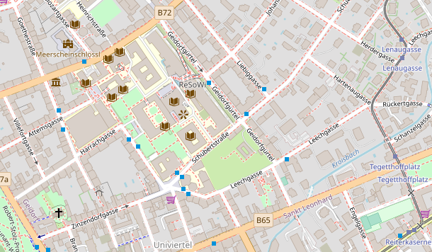

# OER-Infrastruktur-Barcamp

## Informationen
Wie könnte und sollte Infrastruktur für Open Educational Resources (OER) an unseren Hochschulen aussehen? 
Welche Erwartungen an OER-Repositories (und OER-Suchportale) sind vernünftig, welche Hoffnungen sind berechtigt? 
Sind die derzeitigen Bestrebungen auf dem richtigen Weg? Und wenn ja: ist es noch weit? 

Im Rahmen eines Barcamps zum Dachthema "OER-Infrastruktur" möchten wir gegenseitige Einblick in aktuelle Infrastrukturprojekte ermöglichen und gemeinsam Fragen und Visionen diskutieren, die die technische und organisatorische Bereitstellung von OER betreffen. 

Das Barcamp richtet sich an Admins und Manager_innen von OER-Repositorien, mit der Produktion und Distribution von OER befasste und daran interessierte Personen ein!

* * *

## Datum
22.04.2022

## Ort 
  
[Universität Graz](https://www.uni-graz.at/)

## Veranstalter
Arbeitspaket 2 " Lokale Repositorien aufbauen und weiterenwickeln" des Projekts [Open Education Austria](https://www.openeducation.at/)

## Kontakt und Anmeldung
via E-Mail
